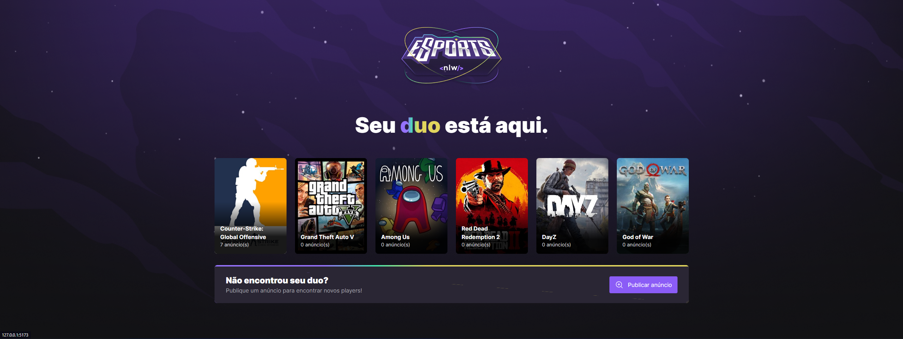

# Rocketseat Bootcamp: NLW eSports 

<h1 align="center"> </h1>
<h1 align="center"> </h1>

**About this Project:**

This was the project developed at NLW eSports.

The website version was developed in react. in this, the user can publish an ad to play with someone else.

The mobile version was developed in react native, in which the user can consult the ads to play and capture the address of the call.

The backend part was used sqlite to save the data to manage the data was used in the prisma tool.

**Technologies**

- React
- React Native
- TypeScript
